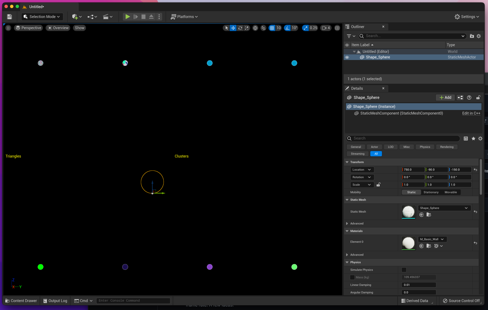

# Nanite on macOS

Brings the Nanite feature from Unreal Engine 5 to Apple platforms. Read over [this forum thread](https://forums.unrealengine.com/t/lumen-nanite-on-macos/508411) for more context.



> Screenshot taken on September 19, 2022. Configuration: 32-core M1 Max, macOS 12.5.1, Xcode 13.4.1

## How it Works

Nanite can run entirely through 32-bit atomics, without creating data races. The [AtomicsWorkaround](./AtomicsWorkaround) directory provides source code demonstrating this workaround. Eventually, `ue5-nanite-macos` will use the workaround to make Nanite run without graphical glitches.

Furthermore, this port needs to create major optimizations for macOS and iOS. The previous port (UE5NanitePort) ran at around 15 frames per second - far from optimal. The 64-bit atomics workaround could make this even slower, requiring very creative thinking to maximize frame rate. A few ideas:
- Decouple atomic writes from rasterization, then distribute the writes evenly among simdgroups.
- Use MetalFX temporal upscaling, which is optimized for M1 GPUs. UE5's built-in Temporal Super Resolution is optimized for AMD GPUs.
- Minor architectural improvements for the Apple GPU architecture, which is very similar to RDNA.

## Usage

Thorough instructions for how to compile UE5 from source and replicate what I've done:

<details>
<summary>Prerequisites</summary>

---

- At least 200 GB of free disk space, after installing everything described below.
- Install [Homebrew](https://brew.sh).
- Install Git. This can be accomplished using Homebrew: `brew install git`.
- Install Xcode 13.6<sup>1</sup> from [developer.apple.com](https://developer.apple.com/xcode/resources). Place the unzipped app in `~/Applications` and name it `Xcode-13`.
- [Create](https://www.epicgames.com/id/register) an Epic Games account and [link](https://www.epicgames.com/help/en-US/epic-accounts-c5719348850459/connect-accounts-c5719351300507/how-do-i-link-my-unreal-engine-account-with-my-github-account-a5720369784347) it to your GitHub account.

> <sup>1</sup>Xcode 14 was released in September 2022. I made most of this guide using Xcode 14 beta. I later learned that it crashes unexpectedly, aborting 40-minute builds that have almost finished. Please stick with Xcode 13 until someone finds a solution to the `XCBBuildService` crash.

Perform the following in a new Terminal window, then close the window. This ensures\* that UnrealBuildTool uses Xcode beta instead of regular Xcode.

```
>>> sudo xcode-select --switch ~/Applications/Xcode-beta.app
[Prompt to enter password]
>>> swift --version
[Swift 5.7 should appear in the output]
```

> \*I'm not 100% sure this is necessary, but it's better to play it safe.

</details>
<details>
<summary>Sign in and download 'EpicGames/UnrealEngine'</summary>

---

Launch the `Xcode-beta` app and go to <b>Menu Bar > Xcode > Preferences > Accounts</b>. Click the "+" button on the bottom left, then select the "GitHub" account type. A popup prompts you for a GitHub [access token](https://docs.github.com/en/authentication/keeping-your-account-and-data-secure/creating-a-personal-access-token). Generate one with the scopes listed below. <ins>Do not</ins> close the browser window showing that token's letters/digits until you've cloned the UE5 repository.

- admin:public_key
- write:discussion
- repo
- user

Enter your GitHub account username and the access token. Click "Sign In", then quit and restart Xcode beta. Create a folder called `UnrealEngine` in `~/Documents`. Right-click it in Finder and click "New Terminal at Folder". Enter these commands into the new Terminal window:

```
>>> pwd
/Users/<your username>/Documents/UnrealEngine
>>> git clone --single-branch -b ue5-main https://github.com/EpicGames/UnrealEngine
```

While cloning the UE5 repository, it may ask for your credentials. Enter the access token from above instead of your account password. The download takes over 10 minutes with average internet speeds, so `git clone` has flags that minimize the amount of downloaded commits.

</details>
<details>
<summary>Compile unmodified 'ue5-main'</summary>

---

On [this guide](https://docs.unrealengine.com/5.0/en-US/downloading-unreal-engine-source-code), follow steps 3 and 4 of "Downloading the Source Code". Right-click `UE5.xcworkspace` and select <b>Open With > Xcode-beta</b>. The instructions below are adapted from [another guide](https://docs.unrealengine.com/5.0/en-US/building-unreal-engine-from-source), which is slightly outdated; no `UE4Editor` or `UE5Editor` scheme exists. Do not run through the latter guide.

Click <b>Menu Bar > Product > Build</b>. The command fails\* because an `Info.plist` is not generated. In the project navigator, select <b>Engine > UE5</b>. Click the <b>Build Settings</b> tab, then look at <b>PROJECT</b> on the left. Select <b>UE5</b>, which has a blue App Store icon next to it. In the build settings search bar, type "generate info". Only one setting pops up: "Generate Info.plist File". Change its value from "No" to "Yes". Repeat these steps for <b>Build Settings > TARGETS > UE5</b>.

> \*This failure only happens on Xcode 14 beta. You must repeat this workaround for all Unreal C++ projects, going through <b>Games > ProjectName > Build Settings</b> instead.

Click <b>Menu Bar > Product > Build</b>. Compilation should take on the order of 10 - 30 minutes. Open the `Activity Monitor` application, and 8-10 `clang` processes\* should create ~100% CPU load\** after the build starts. If they max out at ~50% CPU load, something is going wrong.

> \*Sort by <b>% CPU</b> in descending order to see the `clang` processes.
>
> \**Refer to the graph at the bottom of the window for CPU load, <ins>not</ins> the number(s) below <b>% CPU</b>.

Click <b>Menu Bar > Product > Run</b>. Give Unreal Editor permission to access `Documents`. The application shuts down\* after accessing a nonexistent `YES/YES.uproject`; check the Xcode console to validate that the failure happens. Now, navigate to this path in Finder and double-click the `UnrealEditor` application:

```
/Users/<your username>/Documents/UnrealEngine/UnrealEngine/Engine/Binaries/Mac
```

> \*This failure happens on both Xcode 13 (from the Mac App Store) and Xcode 14 beta.

After some time, the "Unreal Project Browser" window appears.

</details>
<details>
<summary>Fork 'EpicGames/UnrealEngine'</summary>

---

> Throughout this section, `<username>` refers to your GitHub username.

On the GitHub website, fork [`EpicGames/UnrealEngine`](https://github.com/EpicGames/UnrealEngine). Check the box for cloning only the `release` branch; this minimizes the fork's size. Verify that a private repo exists at `https://github.com/<username>/UnrealEngine`.

In Finder, go to `~/Documents/UnrealEngine/UnrealEngine` and click "New Terminal at Folder". Enter these commands:

```
>>> git branch
* ue5-main
>>> git remote
origin
>>> git remote add <username> https://github.com/<username>/UnrealEngine
>>> git checkout -b modifications
>>> git add .
>>> git commit -m "Test Commit"
[modifications db644854a9] Test Commit
 2 files changed, 98 insertions(+)
 create mode 100644 Engine/Config/DefaultEngine.ini
 create mode 100644 Engine/Config/DefaultInput.ini
>>> git push <username> modifications
[Push should succeed]
```

Open your `modifications` branch on GitHub and view the commit history. Click the commit titled "Test Commit". It should add two new files to `Engine/Config`.

</details>
<details>
<summary>First Unreal Project</summary>

---

Open the Unreal Editor app from `Engine/Binaries/Mac` inside the UE5 source folder. Right-click it in Dock and select <b>Options > Keep in Dock</b>. This removes the need to search through Finder when launching the editor.

In the Unreal Project Browser, go to <b>GAMES > First Person > Project Defaults > C++</b>. Do not choose <b>BLUEPRINT</b>. Blueprint projects launch seamlessly with a custom UE5 build, but C++ projects require the troubleshooting detailed in this section. Set <b>Project Name</b> to `UnrealProject1` and click <b>Create</b>.

The Unreal Editor automatically quits, then opens an Xcode project titled `UnrealProject1`. Relaunch the Unreal Editor app go to <b>RECENT PROJECTS > UnrealProject1 > Open</b>. A popup says certain modules are missing; click <b>Yes</b> to rebuild them. A few seconds later, another popup says the modules cannot compile. Dismiss it and click on the Xcode window for UnrealProject1.

Click <b>Menu Bar > Product > Build</b>. The command fails just like when building UE5 from source. Scroll up to the section above that describes the workaround. Go through <b>Games > ProjectName > Build Settings</b> in the Xcode project navigator, instead of <b>Engine > UE5 > Build Settings</b>. The latter path does not affect this project and may cause Xcode to recompile UE5 from scratch.

Build the project again. It should succeed\*, taking only a minute. If it takes longer than 10 minutes, locate it in Finder (`~/Documents/Unreal Projects/UnrealProject1`) and validate that it is not rebuilding UE5 from scratch. Right-click the folder and select <b>Get Info</b>; its size should be on the order of 1 GB.

> \*Ignore the warning stating "Run script build phase 'Sign Manual Frameworks' will be run during every build".

Launch the Unreal Editor and open UnrealProject1. This time, the 3D graphical user interface should appear.

</details>
<details>
<summary>Revert to Xcode 13</summary>

---

On a local machine, I force-enabled [`NaniteAtomicsSupported()`](https://github.com/EpicGames/UnrealEngine/blob/07cf5345692d0c6ce80a748c001efea5eee16eb1/Engine/Source/Runtime/RenderCore/Public/RenderUtils.h#L713-L743) and the build system acted strangely. `XCBBuildService` crashed in the middle of every build, making UnrealBuildTool execute in the background. I could not track UnrealBuildTool's progress in Xcode to estimate when it would finish. The second time this happened, I noticed that Clang was still consuming 100% CPU and `XCBBuildService` had silently respawned in Activity Monitor. 
 
Disk space started getting eaten up and I could not find which folder was consuming increasingly more disk space. `~/Documents/UnrealEngine` stayed constant at 199 GB, while <b>Menu Bar >  > About This Mac > Storage</b> showed a gigabyte being consumed every ~10 seconds. I had to reboot my Mac, reset the `UnrealEngine` directory, and recompile with Xcode 13. Nanite doesn't require Metal 3 functionality, so Xcode 14 beta is not necessary.

To debug `UnrealEditor.app` when it crashes, you must launch it from Xcode. This requires a pre-existing project that the Unreal Editor can open by default. Open the unmodified Unreal Editor app from Dock, and the Unreal Project Browser appears. Go to <b>GAMES > First Person > Project Defaults > BLUEPRINT</b>. Using Blueprints instead of C++ prevents UnrealBuildTool from creating unwanted popups. Set the name to `YES` and click <b>Create</b>.
 
Copy the `YES` project folder from `~/Documents/Unreal Projects` to `~/Documents/UnrealEngine/UnrealEngine`. This lets Unreal Editor automatically detect it when launched from inside Xcode. Finally, open `UE5.xcworkspace` and select <b>Menu Bar > Product > Run</b>. Open the editor this way after incorporating the code changes described below.

</details>
<details>
<summary>Facing extremely long build times</summary>

---

UnrealBuildTool performs poorly with incremental builds of Unreal Engine, and each full recompilation takes about an hour with Xcode 13. I haven't validated whether it ran faster with Xcode 14 beta. I am trying to debug certain changes to the code because some results are unexpected. Here is a grid of all the combinations of conditions, along with the observed behavior.

- `NaniteAtomicsSupported()`: [RenderUtils.h](https://github.com/EpicGames/UnrealEngine/blob/07cf5345692d0c6ce80a748c001efea5eee16eb1/Engine/Source/Runtime/RenderCore/Public/RenderUtils.h#L713-L743)
- `GRHISupportsAtomicUInt64`: [RHI.cpp](https://github.com/EpicGames/UnrealEngine/blob/07cf5345692d0c6ce80a748c001efea5eee16eb1/Engine/Source/Runtime/RHI/Private/RHI.cpp#L1391)

|   | `GRHISupportsAtomicUInt64` is false | `GRHISupportsAtomicUInt64` is true |
| - | ----------------------------------- | ---------------------------------- |
| `NaniteAtomicsSupported()` left as-is | Runs smoothly with Nanite disabled. <ins>Build time: unknown</ins> | Observations unusable; `bSupportsNanite=true` was unset. <ins>Build time: 55 minutes</ins> (from scratch, 3600 actions, 8 processes) |
| `NaniteAtomicsSupported()` always returns true, only when `PLATFORM_APPLE` is defined | Crashes<sup>[1]</sup> after rendering anything. <ins>Build time: 44 minutes</ins> (using cached build products, 2400 actions, 10 processes) | |
| `NaniteAtomicsSupported()` always returns true; its original code is commented out | | Did not finish compilation. <ins>Build time: aborted</ins> |

<details>
<summary><sup>1</sup>Crash description</summary>

```
[UE] Assertion failed: GRHIPersistentThreadGroupCount > 0 [File:./Runtime/Renderer/Private/Nanite/NaniteCullRaster.cpp] [Line: 1738] 
GRHIPersistentThreadGroupCount must be configured correctly in the RHI.
```

</details>

I figured out the bug. I did not set `bSupportsNanite=true` in `DataDrivenPlatformInfo.ini`. After setting that, the editor crashes as expected. My next step is cleaning up the UnrealEngine fork. Heads up for anyone compiling my fork: [Git corrupted the `YES/YES.uproject`](https://github.com/philipturner/ue5-nanite-macos/issues/1). It's sufficient to launch Unreal Editor from within Xcode, but the scene is empty. Navigate to <b>Menu Bar > File</b> in the editor and open a different project.

Next, I tried forcing UE5 to perform unity builds. These supposedly decrease compile time but allow for mistakes where you forget an `#include` directive. Under `~/.config/Unreal Engine/UnrealBuildTool/BuildConfiguration.xml`, I set the following XML tags to `true`: "bUseUnityBuild", "bForceUnityBuild", and "bUseUBTMakefiles". There's no way to validate whether this hack works, but incremental builds seem to be running faster now.

</details>

## Modifications to UE5

[This link](https://github.com/philipturner/UnrealEngine/commits/modifications) shows my most recent modifications to Unreal Engine. Sign into your Epic Games-licensed GitHub account to view it. I also post raw source code in `ue5-nanite-macos`, explaining it below.

### Change 1

Look at [`Sources/RenderUtils_Changes.h`](./Sources/RenderUtils_Changes.h) in this repository. In UE source code, navigate to the path (1) below. Replace the body of `NaniteAtomicsSupported()` with my changes. At path (2), add `bSupportsNanite=true` underneath `[ShaderPlatform METAL_SM5]`. This only enables Nanite on macOS, not iOS or tvOS yet. The engine now crashes at runtime.

```
(1) Engine/Source/Runtime/RenderCore/Public/RenderUtils.h
(2) Engine/Config/Mac/DataDrivenPlatformInfo.ini
```

<details>
<summary>Crash description</summary>

```
[UE] Assertion failed: GRHIPersistentThreadGroupCount > 0 [File:./Runtime/Renderer/Private/Nanite/NaniteCullRaster.cpp] [Line: 1738] 
GRHIPersistentThreadGroupCount must be configured correctly in the RHI.
```

</details>
<a id="investigation-of-change-4"></a>
<details>
<summary>Investigation of change 4</summary>

---

> This section does not follow sequentially from the sections above. Check back here after implementing changes 1 - 3.

</details>

### Change 2

To fix the crash above, set the persistent thread group count for MetalRHI to 1440 - the same value as DirectX and Vulkan. Navigate to the path below and change `FMetalDynamicRHI::Init()` to the contents of [`Sources/MetalRHI_Changes.cpp`](./Sources/MetalRHI_Changes.cpp). The engine now crashes because it cannot find `FInstanceCull_CS`. The GPU had a soft fault before UE crashed, so something is going very wrong.

```
Engine/Source/Runtime/Apple/MetalRHI/Private/MetalRHI.cpp
```

<details>
<summary>Crash description</summary>

```
GPU Soft Fault count: 1
2022-09-05 09:50:10.761740-0400 UnrealEditor[68890:538318] [UE] Assertion failed: Shader.IsValid() [File:Runtime/RenderCore/Public/GlobalShader.h] [Line: 201] 
Failed to find shader type FInstanceCull_CS in Platform SF_METAL_SM5
```

</details>

### Change 3

[UE5NanitePort](https://github.com/gladhu/UE5NanitePort) enabled Nanite through a special shader execution path on Apple platforms. The path replaced 32-bit texture atomics with unsafe reads and writes. Depths could register incorrectly, causing hidden objects to appear in front of objects that occlude them. This may explain the graphical glitches in the associated Reddit post. Metal supports 32-bit buffer atomics, so a better solution replaces the textures with buffers. This takes more time to implement, but reduces/eliminates graphical glitches.
 
Since that port, Epic permanently disabled Nanite on platforms that lack 64-bit atomics. [This commit](https://github.com/EpicGames/UnrealEngine/commit/9b68f6b76686b3fabe1c8513efcf95dd74dea1c3#) removed the lock-based control path that used 32-bit atomics. Therefore, my shader modifications heavily diverge from UE5NanitePort. [`Sources`](./Sources) contains the entire contents of each modified shader. Overwrite the files below with their counterparts from `ue5-nanite-macos`:
 
```
Engine/Shaders/Private/Nanite/NaniteRasterizer.usf
Engine/Shaders/Private/Nanite/NaniteWritePixel.ush
Engine/Shaders/Private/ShadowDepthPixelShader.usf
```

At the path below, the shader compiler checks for 64-bit image atomic support. The check happens in 5 different locations and fails each time. 
Use the preprocessor directive in [`Sources/NaniteCullRaster_Changes.cpp`](./Sources/NaniteCullRaster_Changes.cpp) to disable each check.

```
Engine/Source/Runtime/Renderer/Private/Nanite/NaniteCullRaster.cpp
```

Now, Nanite debug views appear in the editor. Rendering any Nanite-enabled object causes a crash.

<details>
<summary>Crash description</summary>

```
[UE] [2022.09.09-17.56.48:845][ 12]LogMaterial: Display: Material /Game/StarterContent/Materials/M_Basic_Wall.M_Basic_Wall needed to have new flag set bUsedWithNanite !
[UE] [2022.09.09-17.57.01:471][129]LogEditorViewport: Clicking Background
[UE] [2022.09.09-17.57.04:933][441]LogSlate: Took 0.000082 seconds to synchronously load lazily loaded font '../../../Engine/Content/Slate/Fonts/Roboto-Regular.ttf' (155K)
[UE] [2022.09.09-17.57.12:041][858]LogActorFactory: Actor Factory attempting to spawn StaticMesh /Game/StarterContent/Shapes/Shape_Sphere.Shape_Sphere
[UE] [2022.09.09-17.57.12:041][858]LogActorFactory: Actor Factory attempting to spawn StaticMesh /Game/StarterContent/Shapes/Shape_Sphere.Shape_Sphere
[UE] [2022.09.09-17.57.12:042][858]LogActorFactory: Actor Factory spawned StaticMesh /Game/StarterContent/Shapes/Shape_Sphere.Shape_Sphere as actor: StaticMeshActor /Temp/Untitled_0.Untitled:PersistentLevel.StaticMeshActor_0
[UE] Ensure condition failed: 0 [File:./Runtime/Apple/MetalRHI/Private/MetalStateCache.cpp] [Line: 1958] 
Mismatched texture type: EMetalShaderStages 1, Index 0, ShaderTextureType 2 != TexTypes 9
```

</details>

## Change 4

> To come up with this change, I spent several days looking for the source of a bug. Read ["Investigation of change 4"](#investigation-of-change-4) under [Usage](#usage) to learn how the bug was solved.

> TODO: Extract this bug investigation into one of the dropdowns way above <b>Change 1</b>. Shrink this section to include only the patch, but link to the bug investigation.

The crash occured while validating resource bindings for a render command. One texture was `.type2D` (raw value 2) and the other was `.typeTextureBuffer` (raw value 9). In the fragment shader source below, one argument is a `texture_buffer`. A 2D texture was bound in the location of this resource.

<details>
<summary>Vertex shader</summary>

```metal
#include <metal_stdlib>
#include <simd/simd.h>

using namespace metal;

struct type_Globals
{
    float DownsampleFactor;
    float2 InvViewSize;
};

constant float2 _44 = {};

struct RasterizeToRectsVS_out
{
    float2 out_var_TEXCOORD0 [[user(locn0)]];
    float2 out_var_TEXCOORD1 [[user(locn1)]];
    float out_var_RECT_INDEX [[user(locn2)]];
    float4 gl_Position [[position, invariant]];
};

vertex RasterizeToRectsVS_out Main_0000092b_c6f0736c(
    constant type_Globals& _Globals [[buffer(0)]], 
    texture_buffer<uint> RectCoordBuffer [[texture(0)]], 
    uint gl_InstanceIndex [[instance_id]], 
    uint gl_VertexIndex [[vertex_id]], 
    uint gl_BaseVertex [[base_vertex]], 
    uint gl_BaseInstance [[base_instance]])
{
    RasterizeToRectsVS_out out = {};
    uint4 _49 = RectCoordBuffer.read(uint((gl_InstanceIndex - gl_BaseInstance)));
    float4 _50 = float4(_49);
    float4 _53 = _50 * _Globals.DownsampleFactor;
    uint4 _54 = uint4(_53);
    bool _55 = (gl_VertexIndex - gl_BaseVertex) == 1u;
    bool _56 = (gl_VertexIndex - gl_BaseVertex) == 2u;
    bool _57 = _55 || _56;
    bool _58 = (gl_VertexIndex - gl_BaseVertex) == 4u;
    bool _59 = _57 || _58;
    bool _60 = _56 || _58;
    bool _61 = (gl_VertexIndex - gl_BaseVertex) == 5u;
    bool _62 = _60 || _61;
    uint _63 = _54.z;
    uint _64 = _54.x;
    uint _65 = _59 ? _63 : _64;
    uint _66 = _54.w;
    uint _67 = _54.y;
    uint _68 = _62 ? _66 : _67;
    uint2 _69 = uint2(_65, _68);
    float4 _74 = float4(_54) * _Globals.InvViewSize.xyxy;
    float2 _82 = float2(_69);
    float2 _83 = _82 * _Globals.InvViewSize;
    float2 _84 = _83 * float2(2.0, -2.0);
    float2 _85 = _84 + float2(-1.0, 1.0);
    float _86 = _85.x;
    float _87 = _85.y;
    float4 _88 = float4(_86, _87, 0.0, 1.0);
    float2 _90 = _44;
    _90.x = float(_59);
    float2 _92 = _90;
    _92.y = float(_62);
    out.gl_Position = _88;
    out.out_var_TEXCOORD0 = float2(_59 ? _74.z : _74.x, _62 ? _74.w : _74.y);
    out.out_var_TEXCOORD1 = _92;
    out.out_var_RECT_INDEX = float((gl_InstanceIndex - gl_BaseInstance));
    return out;
}
```

</details>

<details>
<summary>Fragment shader</summary>

```metal
#pragma clang diagnostic ignored "-Wmissing-prototypes"

#include <metal_stdlib>
#include <simd/simd.h>

using namespace metal;

// Identity function as workaround for bug in Metal compiler
template<typename T>
T spvIdentity(T x)
{
    return x;
}

struct type_Globals
{
    uint4 ClearValue;
};

fragment void Main_0000030f_ba464dd8(
    constant type_Globals& _Globals [[buffer(1)]], 
    texture_buffer<uint, access::write> ClearResource [[texture(0)]], 
    float4 gl_FragCoord [[position]])
{
    ClearResource.write(
        spvIdentity(_Globals.ClearValue), 
        uint(uint(gl_FragCoord.x)));
}
```

</details>
 
The fragment shader was transpiled from an HLSL shader, located at path (1) below. `RESOURCE_TYPE` was set to either 0 or 5, making `ClearResource` a `RWBuffer`. I'll try swapping the fragment shader with another one, where `RESOURCE_TYPE` was set to 1. That should change the clear resource to a `RWTexture2D`.

The command in question began in some other portion of the code base, and on another thread, which I can't see from the stack trace. During the command's creation, all of the Metal shader pipelines and resources were assigned. At the crash site, it read the mismatched pipeline and resource, then failed to encode them into a `MTLCommandBuffer`.

At path (2) below, around line 526, it registers a 2D texture as the clear replacement resource. This happens before any render commands are encoded. Next, `FRHICommandListExecutor` encodes around 100 render commands (path 3, circa line 511). `FMetalRHICommandContext` sets a new graphics PSO (path 4, circa line 258) which I presume uses the vertex/fragment shaders shown above. After encoding a few more commands, the assertion failure happens (path 5, circa line 2066).

```
(1) Engine/Shaders/Private/ClearReplacementShaders.usf
(2) Engine/Source/Runtime/Apple/MetalRHI/Private/MetalUAV.cpp
(3) Engine/Source/Runtime/RHI/Private/RHICommandList.cpp
(4) Engine/Source/Runtime/Apple/MetalRHI/Private/MetalCommands.cpp
(5) Engine/Source/Runtime/Apple/MetalRHI/Private/MetalStateCache.cpp
```

### Breakthrough

After several days of debugging and investigating, I may have traced this crash back to its origin. There are two candidates (shown below). One of these should set a pixel shader that requires a `texture_buffer`. Hopefully, a line of code very close by will also assign a render target of type `.type2D`. The render target doesn't match the pixel shader, and this silent error eventually manifests in a runtime crash.

```
(1) Engine/Source/Runtime/Renderer/Private/Nanite/Nanite.cpp, circa line 761
(2) Engine/Source/Runtime/Renderer/Private/Nanite/NaniteCullRaster.cpp, circa line 2531
```

<details>
<summary>First fragment shader bound at NaniteCullRaster.cpp</summary>

```metal
#pragma clang diagnostic ignored "-Wmissing-prototypes"

#include <metal_stdlib>
#include <simd/simd.h>

using namespace metal;

// Identity function as workaround for bug in Metal compiler
template<typename T>
T spvIdentity(T x)
{
    return x;
}

struct type_Globals
{
    uint VisualizeModeBitMask;
};

struct HWRasterizePS_in
{
    float4 in_var_TEXCOORD0 [[user(locn0)]];
    uint3 in_var_TEXCOORD1 [[user(locn1)]];
};

fragment void Main_00000669_8d8d857e(HWRasterizePS_in in [[stage_in]], constant type_Globals& _Globals [[buffer(3)]], texture2d<uint, access::read_write> OutVisBuffer64 [[texture(0)]], texture2d<uint, access::read_write> OutDbgBuffer64 [[texture(1)]], texture2d<uint, access::read_write> OutDbgBuffer32 [[texture(2)]])
{
    float3 _42 = in.in_var_TEXCOORD0.xyz / float3(in.in_var_TEXCOORD0.w);
    uint2 _48 = uint2(float4(_42, in.in_var_TEXCOORD0.w).xy);
    uint _52 = as_type<uint>(fast::clamp(_42.z, 0.0, 1.0));
    if (OutVisBuffer64.read(uint2(_48)).y < _52)
    {
        OutVisBuffer64.write(spvIdentity(uint2(in.in_var_TEXCOORD1.x, _52).xyyy), uint2(_48));
    }
    if (OutDbgBuffer64.read(uint2(_48)).y < _52)
    {
        OutDbgBuffer64.write(spvIdentity(uint2(1u, _52).xyyy), uint2(_48));
    }
    OutDbgBuffer32.write(spvIdentity(uint4(OutDbgBuffer32.read(uint2(_48)).x + uint((_Globals.VisualizeModeBitMask & 64u) != 0u))), uint2(_48));
}
```

</details>

<details>
<summary>Second fragment shader bound at NaniteCullRaster.cpp</summary>

```metal
#pragma clang diagnostic ignored "-Wmissing-prototypes"

#include <metal_stdlib>
#include <simd/simd.h>

using namespace metal;

// Identity function as workaround for bug in Metal compiler
template<typename T>
T spvIdentity(T x)
{
    return x;
}

struct HWRasterizePS_in
{
    float4 in_var_TEXCOORD0 [[user(locn0)]];
    uint3 in_var_TEXCOORD1 [[user(locn1)]];
    int4 in_var_TEXCOORD2 [[user(locn2)]];
};

fragment void Main_000004ca_3fb5a62b(HWRasterizePS_in in [[stage_in]], texture2d<uint, access::read_write> OutVisBuffer64 [[texture(0)]])
{
    float3 _36 = in.in_var_TEXCOORD0.xyz / float3(in.in_var_TEXCOORD0.w);
    uint2 _42 = uint2(float4(_36, in.in_var_TEXCOORD0.w).xy);
    bool2 _46 = _42 >= uint2(in.in_var_TEXCOORD2.xy);
    bool2 _49 = _42 < uint2(in.in_var_TEXCOORD2.zw);
    if (all(bool2(_46.x && _49.x, _46.y && _49.y)))
    {
        uint _56 = as_type<uint>(fast::clamp(_36.z, 0.0, 1.0));
        if (OutVisBuffer64.read(uint2(_42)).y < _56)
        {
            OutVisBuffer64.write(spvIdentity(uint2(in.in_var_TEXCOORD1.x, _56).xyyy), uint2(_42));
        }
    }
}
```

</details>

<details>
<summary>Third fragment shader bound at NaniteCullRaster.cpp</summary>

```metal
#pragma clang diagnostic ignored "-Wmissing-prototypes"

#include <metal_stdlib>
#include <simd/simd.h>

using namespace metal;

// Returns buffer coords clamped to storage buffer size
#define spvStorageBufferCoords(idx, sizes, type, coord) metal::min((type)(coord), (type)(sizes[(type)(idx)*3] / sizeof(type)) - 1)

// Identity function as workaround for bug in Metal compiler
template<typename T>
T spvIdentity(T x)
{
    return x;
}

struct type_StructuredBuffer_uint
{
    uint _m0[1];
};

struct HWRasterizePS_in
{
    float4 in_var_TEXCOORD0 [[user(locn0)]];
    uint3 in_var_TEXCOORD1 [[user(locn1)]];
    int4 in_var_TEXCOORD2 [[user(locn2)]];
};

fragment void Main_00000b87_92c3932b(HWRasterizePS_in in [[stage_in]], constant uint* spvBufferSizeConstants [[buffer(2)]], const device type_StructuredBuffer_uint& VirtualShadowMap_PageTable [[buffer(1)]], texture2d_array<uint, access::read_write> OutDepthBufferArray [[texture(0)]])
{
    constant uint& VirtualShadowMap_PageTableBufferSize = spvBufferSizeConstants[1];
    float3 _60 = in.in_var_TEXCOORD0.xyz / float3(in.in_var_TEXCOORD0.w);
    uint2 _66 = uint2(float4(_60, in.in_var_TEXCOORD0.w).xy);
    if (all(_66 < uint2(in.in_var_TEXCOORD2.zw)))
    {
        do
        {
            uint3 _115;
            bool _119;
            do
            {
                uint _85 = _66.x;
                uint _99;
                if (!(in.in_var_TEXCOORD1.z < 8192u))
                {
                    _99 = in.in_var_TEXCOORD1.z + ((_85 >> 7u) + ((_66.y >> 7u) << ((7u - uint(int((in.in_var_TEXCOORD1.y >> 16u) & 255u))) & 31u)));
                }
                else
                {
                    _99 = in.in_var_TEXCOORD1.z;
                }
                uint2 _114 = (uint2(VirtualShadowMap_PageTable._m0[_99] & 1023u, (VirtualShadowMap_PageTable._m0[_99] >> 10u) & 1023u) * uint2(128u)) + (_66 & uint2(127u));
                _115 = uint3(_114.x, _114.y, uint3(_85, _66.y, (in.in_var_TEXCOORD1.y >> 24u) & 255u).z);
                if (!(((VirtualShadowMap_PageTable._m0[_99] & 134217728u) != 0u) && (((VirtualShadowMap_PageTable._m0[_99] >> 20u) & 63u) == 0u)))
                {
                    _119 = false;
                    break;
                }
                _119 = true;
                break;
            } while(false);
            if (!_119)
            {
                break;
            }
            uint _124 = as_type<uint>(fast::clamp(_60.z, 0.0, 1.0));
            if (OutDepthBufferArray.read(uint2(_115.xy), uint(_115.z)).x < _124)
            {
                OutDepthBufferArray.write(spvIdentity(uint4(_124)), uint2(_115.xy), uint(_115.z));
            }
            break;
        } while(false);
    }
}
```

</details>

It doesn't look like crash originates here. After a little more investigation, I traced back the actual source (stack trace below). It makes a lot more sense, because the words `RasterizeToRects` also appear in the captured vertex shader above. This particular stack trace was captured inside an asynchronous task queue, but I have a good idea where it came from.
```
0 void FPixelShaderUtils::AddRasterizeToRectsPass<FClearUAVRectsPS, FClearUAVRectsParameters>(...)
1 /Engine/Source/Runtime/RenderCore/Public/RenderGraphPass.h, line 615 - TEnableIf<!TIsSame<T, FRDGPass>::Value, void>::Type ExecuteLambdaFunc(FRHIComputeCommandList& RHICmdList) 
2 /Engine/Source/Runtime/RenderCore/Public/RenderGraphPass.h, line 629 - void Execute(FRHIComputeCommandList& RHICmdList) override
3 /Engine/Source/Runtime/RenderCore/Private/RenderGraphBuilder.cpp, line 2877 - void FRDGBuilder::ExecutePass(FRDGPass* Pass, FRHIComputeCommandList& RHICmdListPass)
4 /Engine/Source/Runtime/RenderCore/Private/RenderGraphBuilder.cpp, line 2685 - void FRDGBuilder::DispatchParallelExecute(IRHICommandContext* RHICmdContext)
```

Three places in Nanite code call `FPixelShaderUtils::AddRasterizeToRectsPass`. They all happen inside `Nanite::DrawLumenMeshCapturePass`. The mesh capture pass starts with a call to `AddClearUAVPass`, which takes an argument of type `FRDGBufferRef`. All of that terminology matches the stack trace. Now, I need to clean up the massive code mess accumulated from debugging, and move on to the next phase.

---

I read [this 155-page slideshow\*](https://advances.realtimerendering.com/s2021/Karis_Nanite_SIGGRAPH_Advances_2021_final.pdf) on how Nanite works internally. This helped me understand what's going on during the crash and provided nice break from debugging. Since `DrawLumenMeshCapturePass` mentioned Lumen, I looked for in-depth documentation on Lumen. There was an overview presentation from SIGGRAPH 2022, but it wasn't available online.

> \*Note regarding pages 91-92: The workaround for 64-bit atomics has either 2.5x or 5x the overhead, based on number of atomic instructions. Worst-case overhead is unbounded. We might see a performance improvement from a work distribution approach to pixel writing, which can reduce SIMD divergence. This might even benefit hardware rasterization because we're not distributing the computation of pixels; just distributing the atomic write operations after proving the depth test passes. That has greater sparsity than spatial distribution of pixels.
>
> In other words: decouple the HW/SW rasterization from the storage of triangle/instance ID.

Next, I planned to read the source code directly related to Nanite. That equates to this many lines of code:
- `/Engine/Source/Runtime/Renderer/Private/Nanite` Headers: 1554 lines
- `/Engine/Source/Runtime/Renderer/Private/Nanite` C++ Source: 8483 lines
- `/Engine/Shaders/Private/Nanite` HLSL Shaders: 10873 lines

Here, I estimate how long that would take to read. The end result was much lower than I expected - between 1.5 and 5.5 hours. That's about how long it took to digest the 155-page Nanite presentation and the explanation of Lumen. Also, it took longer than this to determine that the crash originates in `DrawLumenMeshCapturePass`.
```
1554 + 8483 + 10873 = 20910 lines
--------------------------------------------------------------------------------
Epic uses extensive whitespace and places control flow brackets on a separate 
line. This approximately doubles the number of "real" source lines.
20910 / 2 = 10455 lines
--------------------------------------------------------------------------------
Average indentation is 10 spaces, average line width is 80 characters. Assume 
each line contains 5 non-alphanumeric characters, which do not form words.
80 - 10 - 5 = 65 characters
10455 * 64 = 679575 characters
--------------------------------------------------------------------------------
In English, average word size is 5 characters. Source code is much more wordy,
so set average word length to 10 characters.
679575 / 10 = 67957 words
--------------------------------------------------------------------------------
The average person can skim text at 700 words per minute. Code is less well-
structured than normal text, and some sections may require deep thought to fully
understand. Therefore, I'll also try the low estimate of reading comprehension 
speed, 200 words per minute.
67957 / 700 = 97 minutes = 1.5 hours
67957 / 200 = 340 minutes = 5.5 hours
--------------------------------------------------------------------------------
Assuming it takes 4 hours to read, here's a breakdown by section.
Headers: 7% of total time = 20 minutes
C++ Source: 41% of total time = 1.5 hours
Shaders: 52% of total time = 2 hours
```

An hour into reading, I found this:
```cpp
RHI_API int32 RHIGetPreferredClearUAVRectPSResourceType(const FStaticShaderPlatform Platform)
{
	if (IsMetalPlatform(Platform))
	{
		static constexpr uint32 METAL_TEXTUREBUFFER_SHADER_LANGUAGE_VERSION = 4;
		if (METAL_TEXTUREBUFFER_SHADER_LANGUAGE_VERSION <= RHIGetMetalShaderLanguageVersion(Platform))
		{
			return 0; // BUFFER
		}
	}
	return 1; // TEXTURE_2D
}
```

Called from:
```cpp
class FClearUAVRectsPS : public FGlobalShader
{
	DECLARE_GLOBAL_SHADER(FClearUAVRectsPS);
	SHADER_USE_PARAMETER_STRUCT(FClearUAVRectsPS, FGlobalShader);

	BEGIN_SHADER_PARAMETER_STRUCT(FParameters, )
		SHADER_PARAMETER(FUintVector4, ClearValue)
		SHADER_PARAMETER_RDG_TEXTURE_UAV(RWTexture2D, ClearResource)
	END_SHADER_PARAMETER_STRUCT()

	...

	static void ModifyCompilationEnvironment(const FGlobalShaderPermutationParameters& Parameters, FShaderCompilerEnvironment& OutEnvironment)
	{
		int32 ResourceType = RHIGetPreferredClearUAVRectPSResourceType(Parameters.Platform);

		FGlobalShader::ModifyCompilationEnvironment(Parameters, OutEnvironment);
		OutEnvironment.SetDefine(TEXT("ENABLE_CLEAR_VALUE"), 1);
		OutEnvironment.SetDefine(TEXT("RESOURCE_TYPE"), ResourceType);
		OutEnvironment.SetDefine(TEXT("VALUE_TYPE"), TEXT("uint4"));
	}
};
```

Called from:
```cpp
void AddClearUAVPass(FRDGBuilder& GraphBuilder, ERHIFeatureLevel::Type FeatureLevel, FRDGTextureUAVRef TextureUAV, const uint32(&ClearValues)[4], FRDGBufferSRVRef RectCoordBufferSRV, uint32 NumRects)
{
 ...
 auto PixelShader = ShaderMap->GetShader<FClearUAVRectsPS>();
 ...
 FPixelShaderUtils::AddRasterizeToRectsPass<FClearUAVRectsPS>(GraphBuilder,
  ...
  PixelShader,
  ...
  );
}
```

The bug actually occurred in a different place; it did not occur in `DrawLumenMeshCapturePass`. `Nanite::InitRasterContext` is the only place that calls the overload of `AddClearUAVPass` defined above. This makes more sense because Nanite crashes the moment I fire it up. Revised origin of crash:
```
/Engine/Source/Runtime/Renderer/Private/Nanite/NaniteCullRaster.cpp, circa line 2690
```

Circa line 2667 of the file above, it always creates a 2D texture for the various inputs into Nanite shaders. These are called `OutDepthBuffer`, `OutVisBuffer64`, `OutDbgBuffer64`, and `OutDbgBuffer32`. That code was only ever tested on DirectX and Vulkan, a platform that defaults to 2D textures for `ClearResource` views. Between the UE5NanitePort and when I investigated the bug, Epic rewrote a certain Nanite shader. They replaced and/or renamed the arguments set at line 2667. Before the change, they may have never triggered the code that sets them as a `texture_buffer` in Metal.

Alternatively, UE5NanitePort could have found this bug and fixed it. The port is a closed-source binary, so I can't see its changes to engine C++ code.

Fix: at path (1) below, comment out the right-hand side of line (2). Replace it with line (3), which forces it to be a 2D texture.
```
(1) /Engine/Source/Runtime/RenderCore/Private/RenderGraphUtils.cpp, circa line 582
(2) int32 ResourceType = RHIGetPreferredClearUAVRectPSResourceType(Parameters.Platform);
(3) int32 ResourceType = 1; //RHIGetPreferredClearUAVRectPSResourceType(Parameters.Platform);
```

Okay, so now it works. I saw a Nanite sphere appear in all 8 debug views inside the Unreal Editor, although I didn't see it in the main view. Then, it froze up and I had to reboot my Mac.

To investigate, I need to read over some more Nanite source code. Then, I should try implementing the [AtomicsWorkaround](./AtomicsWorkaround) and fix all the atomic things I set to non-atomic. Perhaps some shader loop expected a number to be atomically incremented. When it wasn't, the value became corrupted. The integrated GPU looped infinitely and made my Mac unresponsive.

---

I took a screenshot of the Nanite debug views. I have to avoid clicking the editor window, otherwise my Mac freezes. If I leave the window alone, I can still perform everyday actions like working in Xcode and using Google Chrome.


I repeatedly triggered a warning (2) inside RenderCore (1). A few minutes later, I got a new GPU soft fault when the editor autosaved.

```
(1) /Engine/Source/Runtime/RenderCore/Private/ProfilingDebugging/RealtimeGPUProfiler.cpp
(2)
2022-09-19 19:49:50.218770-0400 UnrealEditor[12227:410904] [UE] [2022.09.19-23.49.50:218][  1]LogRendererCore: Warning: Query 'Unaccounted' not ready.
2022-09-19 19:49:58.205410-0400 UnrealEditor[12227:410904] [UE] [2022.09.19-23.49.58:205][ 13]LogRendererCore: Warning: Query 'Unaccounted' not ready.
2022-09-19 19:50:11.704696-0400 UnrealEditor[12227:410904] [UE] [2022.09.19-23.50.11:704][ 52]LogRendererCore: Warning: Query 'Unaccounted' not ready.
2022-09-19 19:50:12.329862-0400 UnrealEditor[12227:410904] [UE] [2022.09.19-23.50.12:329][ 57]LogRendererCore: Warning: Query 'Unaccounted' not ready.
2022-09-19 19:50:23.372222-0400 UnrealEditor[12227:410904] [UE] [2022.09.19-23.50.23:372][ 70]LogRendererCore: Warning: Query 'Unaccounted' not ready.
2022-09-19 19:50:25.610363-0400 UnrealEditor[12227:410904] [UE] [2022.09.19-23.50.25:610][ 80]LogRendererCore: Warning: Query 'Unaccounted' not ready.
2022-09-19 19:50:29.198663-0400 UnrealEditor[12227:410904] [UE] [2022.09.19-23.50.29:198][ 85]LogRendererCore: Warning: Query 'Unaccounted' not ready.
2022-09-19 19:50:32.301911-0400 UnrealEditor[12227:410904] [UE] [2022.09.19-23.50.32:301][ 95]LogRendererCore: Warning: Query 'Unaccounted' not ready.
2022-09-19 19:50:46.777136-0400 UnrealEditor[12227:410904] [UE] [2022.09.19-23.50.46:776][100]LogRendererCore: Warning: Query 'Unaccounted' not ready.
(3)
2022-09-19 19:57:44.219144-0400 UnrealEditor[12227:410904] [UE] [2022.09.19-23.57.44:218][350]LogUObjectHash: Compacting FUObjectHashTables data took   0.20ms
2022-09-19 19:57:44.220352-0400 UnrealEditor[12227:410904] [UE] [2022.09.19-23.57.44:220][350]Cmd: OBJ SAVEPACKAGE PACKAGE="/Temp/Untitled_0" FILE="../../../YES/Saved/Autosaves/Temp/Untitled_0_Auto1.umap" SILENT=true AUTOSAVING=true KEEPDIRTY=false
2022-09-19 19:57:44.221367-0400 UnrealEditor[12227:410904] [UE] [2022.09.19-23.57.44:221][350]LogSavePackage: Moving output files for package: /Temp/Autosaves/Temp/Untitled_0_Auto1
2022-09-19 19:57:44.221478-0400 UnrealEditor[12227:410904] [UE] [2022.09.19-23.57.44:221][350]LogSavePackage: Moving '../../../YES/Saved/Untitled_0_Auto18424315AD444B643906E18A972075761.tmp' to '../../../YES/Saved/Autosaves/Temp/Untitled_0_Auto1.umap'
2022-09-19 19:57:44.222368-0400 UnrealEditor[12227:410904] [UE] [2022.09.19-23.57.44:222][350]LogFileHelpers: Editor autosave (incl. external actors) for '/Temp/Untitled_0' took 0.034
2022-09-19 19:57:44.222458-0400 UnrealEditor[12227:410904] [UE] [2022.09.19-23.57.44:222][350]LogFileHelpers: Editor autosave (incl. sublevels & external actors) for all levels took 0.034
2022-09-19 19:57:44.222696-0400 UnrealEditor[12227:410904] [UE] [2022.09.19-23.57.44:222][350]OBJ SavePackage: Generating thumbnails for [1] asset(s) in package [/Game/StarterContent/Materials/M_Basic_Wall] ([1] browsable assets)...
2022-09-19 19:57:44.365219-0400 UnrealEditor[12227:410904] [UE] [2022.09.19-23.57.44:365][350]OBJ SavePackage:     Rendered thumbnail for [Material /Game/StarterContent/Materials/M_Basic_Wall.M_Basic_Wall]
2022-09-19 19:57:44.365386-0400 UnrealEditor[12227:410904] [UE] [2022.09.19-23.57.44:365][350]OBJ SavePackage: Finished generating thumbnails for package [/Game/StarterContent/Materials/M_Basic_Wall]
2022-09-19 19:57:44.365524-0400 UnrealEditor[12227:410904] [UE] [2022.09.19-23.57.44:365][350]Cmd: OBJ SAVEPACKAGE PACKAGE="/Game/StarterContent/Materials/M_Basic_Wall" FILE="../../../YES/Saved/Autosaves/Game/StarterContent/Materials/M_Basic_Wall_Auto1.uasset" SILENT=false AUTOSAVING=true
2022-09-19 19:57:44.366561-0400 UnrealEditor[12227:410904] [UE] [2022.09.19-23.57.44:366][350]LogSavePackage: Moving output files for package: /Temp/Autosaves/Game/StarterContent/Materials/M_Basic_Wall_Auto1
2022-09-19 19:57:44.366720-0400 UnrealEditor[12227:410904] [UE] [2022.09.19-23.57.44:366][350]LogSavePackage: Moving '../../../YES/Saved/M_Basic_Wall_Auto10954F2D8614414D856C02BACBCA1C362.tmp' to '../../../YES/Saved/Autosaves/Game/StarterContent/Materials/M_Basic_Wall_Auto1.uasset'
2022-09-19 19:57:44.366933-0400 UnrealEditor[12227:410904] [UE] [2022.09.19-23.57.44:366][350]OBJ SavePackage: Generating thumbnails for [1] asset(s) in package [/Game/StarterContent/Shapes/Shape_Sphere] ([1] browsable assets)...
2022-09-19 19:57:44.704431-0400 UnrealEditor[12227:410904] [UE] [2022.09.19-23.57.44:704][350]OBJ SavePackage:     Rendered thumbnail for [StaticMesh /Game/StarterContent/Shapes/Shape_Sphere.Shape_Sphere]
2022-09-19 19:57:44.704543-0400 UnrealEditor[12227:410904] [UE] [2022.09.19-23.57.44:704][350]OBJ SavePackage: Finished generating thumbnails for package [/Game/StarterContent/Shapes/Shape_Sphere]
2022-09-19 19:57:44.704792-0400 UnrealEditor[12227:410904] [UE] [2022.09.19-23.57.44:704][350]Cmd: OBJ SAVEPACKAGE PACKAGE="/Game/StarterContent/Shapes/Shape_Sphere" FILE="../../../YES/Saved/Autosaves/Game/StarterContent/Shapes/Shape_Sphere_Auto1.uasset" SILENT=false AUTOSAVING=true
2022-09-19 19:57:44.708663-0400 UnrealEditor[12227:410904] [UE] [2022.09.19-23.57.44:708][350]LogSavePackage: Moving output files for package: /Temp/Autosaves/Game/StarterContent/Shapes/Shape_Sphere_Auto1
2022-09-19 19:57:44.708780-0400 UnrealEditor[12227:410904] [UE] [2022.09.19-23.57.44:708][350]LogSavePackage: Moving '../../../YES/Saved/Shape_Sphere_Auto1F20B5BF64F41FC42939908B3AF9E388B.tmp' to '../../../YES/Saved/Autosaves/Game/StarterContent/Shapes/Shape_Sphere_Auto1.uasset'
2022-09-19 19:57:44.708871-0400 UnrealEditor[12227:410904] [UE] [2022.09.19-23.57.44:708][350]LogFileHelpers: Auto-saving content packages took 0.486
2022-09-19 19:57:45.016897-0400 UnrealEditor[12227:417732] GPU Soft Fault count: 1905
```

I swapped out one texture (`DbgBuffer32`) for a buffer, and it still froze the iGPU, to the point where I had to reboot my Mac. I'm not sure whether the Unreal Editor was worse off than before the modification. Regardless, I now understand how to bind new resources to the HLSL shaders. I should be able to implement the entire atomics workaround, then see if that fixes anything. If not, this narrows down the list of possible causes.

> TODO: It's already pretty clear that a "Change 4" exists. Fix the section of code that treated a 2D texture like a texture buffer. I can transfer the current bug investigation into a "Change 5".

## Attribution

This repo sources some information from [UE5NanitePort](https://github.com/gladhu/UE5NanitePort). By linking to the repository, I hereby give the creator attribution for their work.

I also reused ideas found on the "Lumen & Nanite on MacOS" thread from Epic Dev Community forums.
